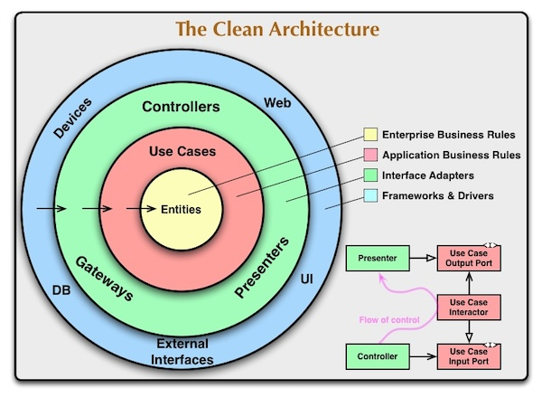

# Colabo README

## Description

**Colabo Demo** Code illustrating *Clean Architecture*, RESTful *API*s best practices.

[Colabo.Space](https://www.colabo.space) (Light)

## Architecture

### Clean Architecture



There are different approaches regarding tradeoffs between **modularity** (*horizontal independence*, separation of concerns) offered by frameworks like **NestJS** and (vertical independence) addressed by **Clean Architecture** (CA).

We propose horizontal separation in modules for each **resource** (e.g. NestJS `module/resource`). In addition, we have a `common` "module". Each model/resource would internally follow CA layers and The Dependency Rule (DR).

**CA layers** could be:

1. physically imposed (by the creation of folders `entities` (i.e. business `domain`), `use-cases`, `adapters`, `frameworks`, in a module);
   - this would prevent accidental dependencies on DR
   - but would complicate the structure;
2. not separating files in folders, but following the framework (i.e. NestJS) separation and then following *"(un)written" rules* of separation and DR
   - this would allow accidental crossing of layers against DR
   - but would allow us to more easily/closely follow file separation by the chosen framework.

We have chosen the **2nd approach**.  

Each `model` should be in the folder of its resource module (e.g. `src/resource/frameworks/data-services/model/resource.model`) instead of all grouped in `src/common/frameworks/data-services/mongo/model/resource1.model.ts`

### Tech Stack

- [NestJS](https://github.com/nestjs/nest) framework TypeScript starter repository.
- ...

## Installation

```bash
$ pnpm install
```

## Running the app

```bash
# development
$ pnpm run start

# watch mode
$ pnpm run start:dev

# production mode
$ pnpm run start:prod
```

at address `http://localhost:3000/api` (where 3000 is APP_PORT) we can access Swagger for our API

## Test

```bash
# unit tests
$ pnpm run test

# e2e tests
$ pnpm run test:e2e

# test coverage
$ pnpm run test:cov
```

## License

copyright: Sinisha Rudan & Sasha Rudan, Cha-os.org; non-open source code (to be detailed ...)
